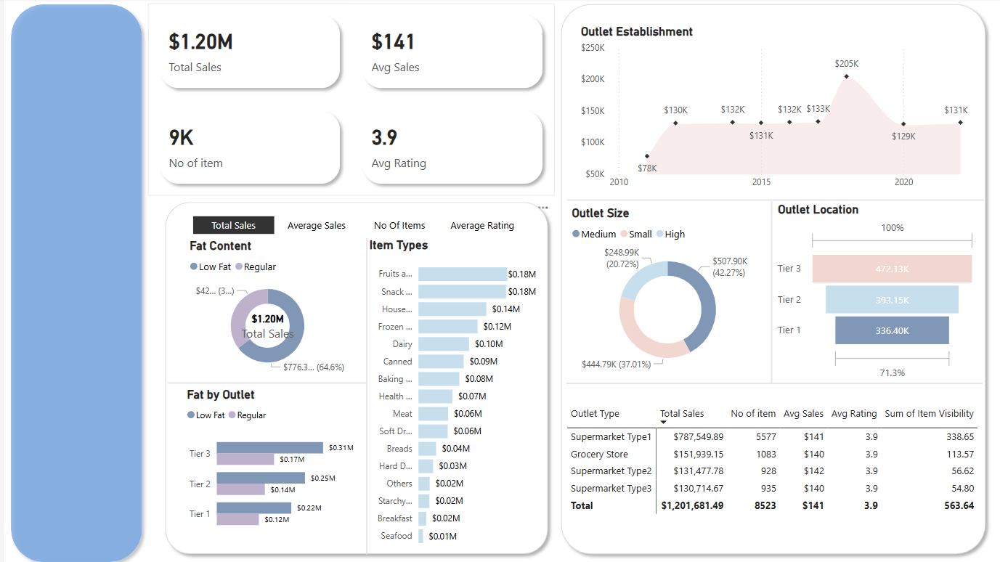

# Grocery Sales Analysis Portfolio

This is a portfolio project to demonstrate my data analysis skills using SQL, Python, and Power BI on a grocery sales dataset.

## 🔧 Tools Used
- Power BI
- SQL (MySQL / PostgreSQL / SQLite)
- Python (pandas, matplotlib, seaborn)

## 📁 Project Structure
- `datasets/`: Raw data used in the project.
- `sql_queries/`: SQL scripts for data exploration and cleaning.
- `notebooks/`: Python notebook for data analysis and visualization.
- `powerbi/`: Power BI dashboard file.
- `images/`: Screenshots of dashboards and charts.

## 🧪 Objectives
- Understand sales patterns by category, store, and time.
- Detect seasonal trends and product performance.
- Visualize KPIs using Power BI.

## 📊 Dashboard Preview

## 📌 Key Insights
- Top 5 products contribute 40% of sales.
- Weekend sales are 30% higher than weekdays.
- Fresh category has highest seasonal variance.

## 📂 How to Run
1. Clone the repo.
2. Open `analysis.ipynb` for Python-based exploration.
3. Open `dashboard.pbix` using Power BI Desktop.
